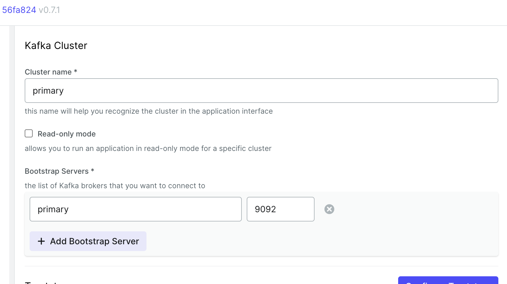

# Kafka installation and related tools

## Quickstart

See APACHE [KAFKA QUICKSTART](https://kafka.apache.org/quickstart) tutorial.


wget https://dlcdn.apache.org/kafka/3.6.1/kafka_2.13-3.6.1.tgz
tar -xzvf kafka_2.13-3.6.1.tgz 
sudo mv kafka_2.13-3.6.1 /opt/
cd /opt
sudo ln -s kafka_2.13-3.6.1 kafka
cd kafka
./bin/zookeeper-server-start.sh config/zookeeper.properties 

(from another terminal)

cd /opt/kafka
./bin/kafka-server-start.sh config/server.properties

## Monitoring tools based on Docker

You can use [kafka-ui](https://github.com/provectus/kafka-ui):

**Note:** remember to change IP address to your VM IP and hostname. You also need the explicit hostname of your Kafka server since zookeeper pass this name to the client kafka-ui. Type `hostname` to checkout the expected name.

```
docker run --rm -p 8090:8080 \
    -e DYNAMIC_CONFIG_ENABLED=true \
    --name kafka-ui \
    --add-host=primary:192.168.205.3 \
    provectuslabs/kafka-ui
```

In the configuration pannel you need to use the expected hostaname as shown below:


.


