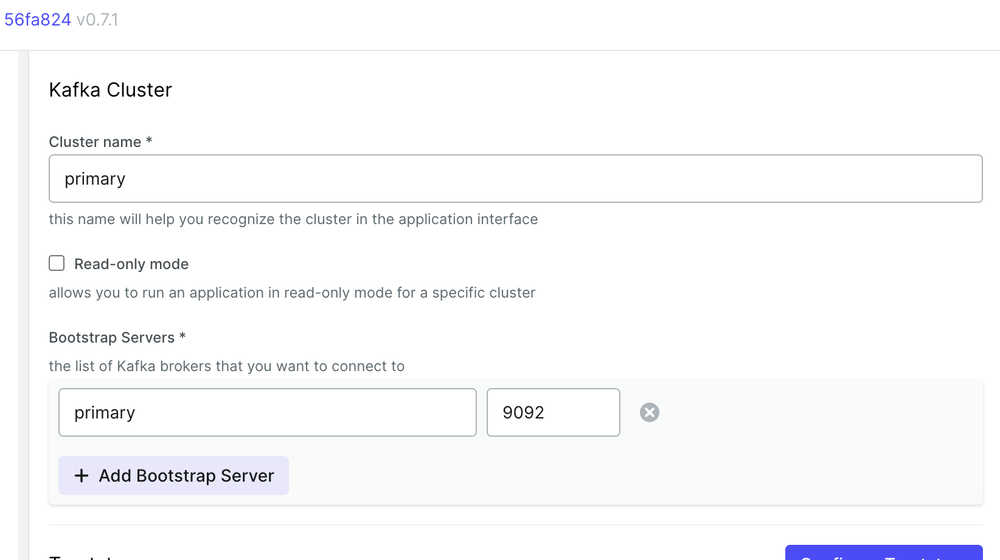

# Kafka installation and related tools

## Quickstart

See APACHE [KAFKA QUICKSTART](https://kafka.apache.org/quickstart) tutorial.

```
wget https://dlcdn.apache.org/kafka/3.6.1/kafka_2.13-3.6.1.tgz
tar -xzvf kafka_2.13-3.6.1.tgz 
sudo mv kafka_2.13-3.6.1 /opt/
cd /opt
sudo ln -s kafka_2.13-3.6.1 kafka
cd kafka
./bin/zookeeper-server-start.sh config/zookeeper.properties 
```

(from another terminal)

```
cd /opt/kafka
./bin/kafka-server-start.sh config/server.properties
```

## Installing Kafka as a service

First you need to setuo the service for Zookeeper

    sudo nano  /etc/systemd/system/zookeeper.service

Copyt the content below:

```
[Unit]
Description=Apache Zookeeper server
Documentation=http://zookeeper.apache.org
Requires=network.target remote-fs.target
After=network.target remote-fs.target

[Service]
Type=simple
ExecStart=/opt/kafka/bin/zookeeper-server-start.sh /opt/kafka/config/zookeeper.properties
ExecStop=/opt/kafka/bin/zookeeper-server-stop.sh
Restart=on-abnormal

[Install]
WantedBy=multi-user.target
```

Save the changes and exit.
Then you need to install Kafka service

    sudo nano  /etc/systemd/system/kafka.service

Copyt the content below:

```
[Unit]
Description=Apache Kafka Server
Documentation=http://kafka.apache.org/documentation.html
Requires=zookeeper.service

[Service]
Type=simple
ExecStart=/opt/kafka/bin/kafka-server-start.sh /opt/kafka/config/server.properties
ExecStop=/opt/kafka/bin/kafka-server-stop.sh

[Install]
WantedBy=multi-user.target
```
Save the changes and exit. Reload the services:

    sudo systemctl daemon-reload
    sudo systemctl enable zookeeper
    sudo systemctl enable kafka
    sudo systemctl start zookeeper
    sudo systemctl start kafka

Then check the newly created services:

    journalctl -f -u zookeeper
    journalctl -f -u kafka

## Monitoring tools based on Docker

You can use [kafka-ui](https://github.com/provectus/kafka-ui):

**Note:** remember to change IP address to your VM IP and hostname. You also need the explicit hostname of your Kafka server since zookeeper pass this name to the client kafka-ui. Type `hostname` to checkout the expected name.

```
docker run --rm -p 8090:8080 \
    -e DYNAMIC_CONFIG_ENABLED=true \
    --name kafka-ui \
    --add-host=primary:192.168.205.3 \
    provectuslabs/kafka-ui
```

In the configuration pannel you need to use the expected hostaname as shown below:


.

## Using Kafka with Docker

A good example can be found at:
https://github.com/conduktor/kafka-stack-docker-compose

    git clone https://github.com/conduktor/kafka-stack-docker-compose
    cd kafka-stack-docker-compose
    nano zk-single-kafka-single.yml

Replace `${DOCKER_HOST_IP:-127.0.0.1}` with your IP address, e.g. `${DOCKER_HOST_IP:-192.168.205.3}`.
Then start the docker compose:

    docker-compose -f zk-single-kafka-single.yml up

You can configure kafka-ui to check the server availability.
Then you can run the basic [quick-start examples](../examples/00-basic-example/README.md).


